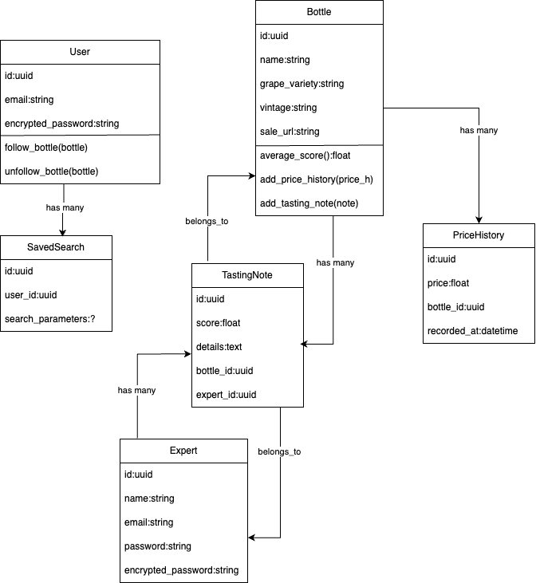

- [PITCH](#pitch)
  - [Source](#source)
  - [Highlights](#highlights)
- [Integration](#integration)
  - [Notifications](#notifications)
- [TODO Next](#todo-next)

## PITCH

### Source

Un porteur de projet vous engage en tant que premier consultant spécialisé dans le développement back-end.

Son pitch

Concevoir une plateforme de recherche référençant les vins vendus sur des sites spécialisés. 
Les données (propriétés de la bouteille, prix et site de vente) pourront être récupérées à partir d’un service externe dont on ne connait pas encore les spécificités. 
Pour se démarquer de la concurrence, la plateforme veut faire la part belle aux experts du domaine avec la possibilité d’intégrer leurs notes de dégustation.
La fonctionnalité à forte valeur serait de fournir une évaluation de chacune des bouteilles, basée sur la moyenne des notes attribuées par ces experts. 
Autres fonctionnalités à fort potentiel :
Un système d’alerting où les utilisateurs peuvent sauvegarder leurs recherches et être notifiés si une bouteille nouvellement identifiée correspond.
L’accès à l’historisation des prix pour chaque bouteille pour comprendre la tendance.

Quand vous lui parlez d’un MVP, le porteur de projet aimerait pouvoir récupérer facilement les vins vendus, classés par meilleure moyenne des notes de dégustation, dont le prix est compris dans l’intervalle fixé par l’utilisateur.

Vous avez rendez-vous avec lui dans quelques jours. Son souhait est que vous proposiez une conception initiale avec une première base du projet afin que les développeurs puissent travailler dans de bonnes conditions.
Vous vous engagez à fournir un premier livrable, idéalement récupérable via un dépôt git. Vous discuterez avec lui de la stratégie future : des développements, des enjeux techniques, de l’infrastructure, ainsi que des nouveaux recrutements nécessaires à la bonne réalisation de ce projet ambitieux.

### Highlights

- wine platform
- fetching online wine bottle data
- required resources
  - Bottle
  - TastingNote
  - Expert
  - User
  - SavedSearch
- Systeme d'alerting

## Integration

Plateforme crée en Ruby on Rails avec postgresql

- Priorité à l'usage API REST
- Définir un outil de seed vin: base de vivino, outil [Github](github.com:aptash/vivino-api.git)
  - Récupération de plusieurs types de vin en JSON
  - -> préparer un seed postgresql
  - voir [python seed folder](/python_vivino_db_seed/)
- Système d'alerting:
  - L'usage de la gem 'noticed' semble être indiquée autant pour du mail que du push notification
- Modélisation de la base
  - 
  - Priorisation de l'usage de l'UUID pour la sécurité

### Notifications

Email can be viewed [Here](http://localhost:3000/rails/mailers/user_mailer/send_new_bottle_email)

## TODO Next

- Improve code with refacto and security tests
- Complete authentication
- Improve DB constrants (unicity etc)
- Improve search discovery
